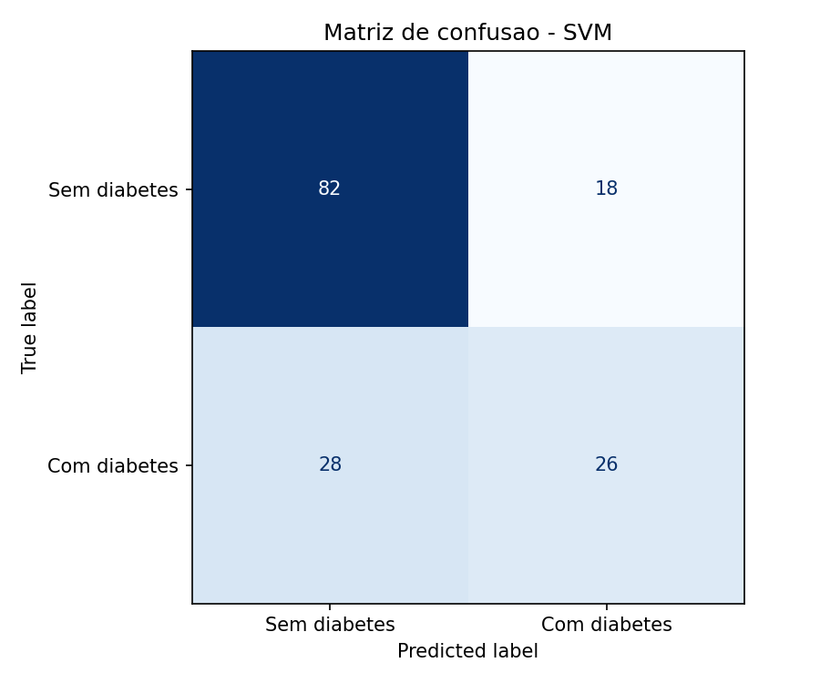
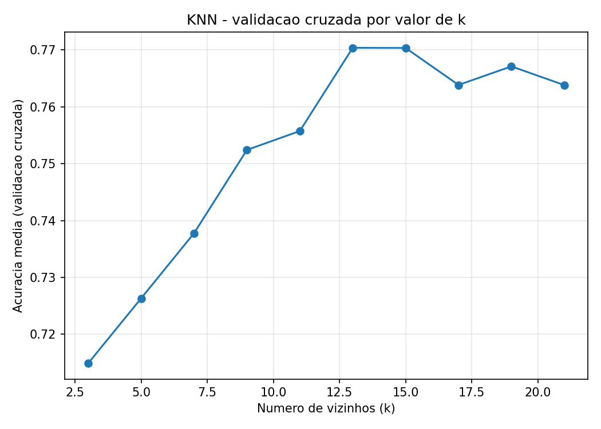
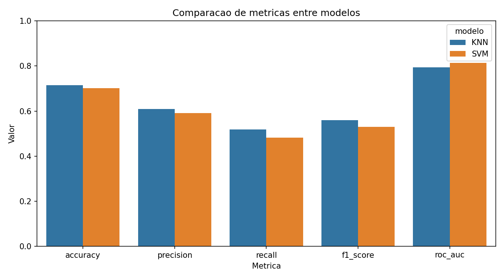
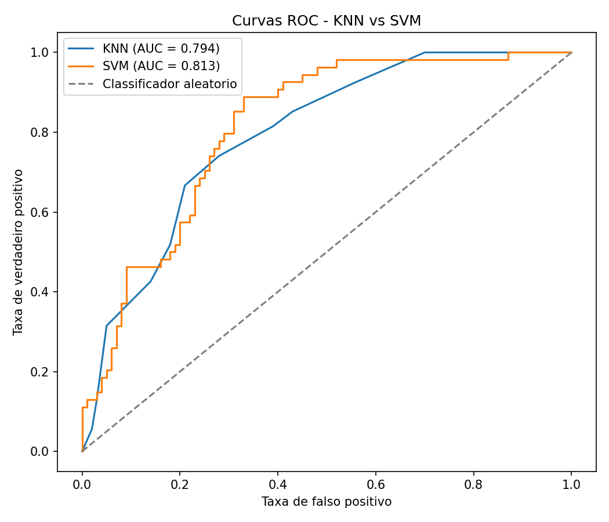

Disciplina de Inteligência Artificial , Professor Munif , Unicesumar 2026

# Trabalho Final - Predição de Diabetes (Pima Indians)

Versão do trabalho otimizada para **Google Colab**. Mesmo dataset, mesmos modelos (KNN + SVM) e mesma análise do repositório principal.

Repositório PC/local: [trabalho-final-ia-diabetes](https://github.com/PedroSilvazDev/trabalho-final-ia-diabetes)

## Integrantes

- Pedro Henrique da Silva - RA: 23021607-2
- Victor Hugo Rodrigues de Oliveira - RA: 23418156-2
- Victor Hungo Silva Garcia - RA: 23030968-2

## Contextualização

O diabetes mellitus é uma doença crônica que afeta milhões de pessoas no mundo. A detecção precoce é fundamental para reduzir complicações e melhorar a qualidade de vida dos pacientes. Com o avanço da Inteligência Artificial, modelos de aprendizado de máquina podem apoiar a identificação de padrões em dados clínicos e auxiliar profissionais de saúde na triagem de risco.

## Problema investigado

Este trabalho investiga se é possível prever a presença de diabetes em pacientes da etnia Pima Indians com base em variáveis clínicas e demográficas, como glicose, pressão arterial, IMC e idade.

## Hipótese

Modelos de classificação supervisionada conseguem distinguir pacientes com e sem diabetes a partir dos atributos disponíveis. Espera-se que o SVM apresente bom desempenho após a padronização dos dados, enquanto o KNN pode ser sensível à escolha do número de vizinhos e à distribuição das classes.

## Dataset utilizado

| Item | Descrição |
|------|-----------|
| Nome | Pima Indians Diabetes Database |
| Origem | Kaggle / UCI Machine Learning Repository |
| Registros | 768 amostras |
| Atributos | 8 variáveis numéricas |
| Variável alvo | Outcome (0 = sem diabetes, 1 = com diabetes) |

Atributos: Pregnancies, Glucose, BloodPressure, SkinThickness, Insulin, BMI, DiabetesPedigreeFunction e Age.

## Preparação dos dados

A limpeza inicial é compartilhada; o **pré-processamento de cada modelo é otimizado separadamente** dentro do pipeline de treino (GridSearchCV):

**Limpeza comum (antes da divisão):**
- Substituição de zeros inválidos por valores ausentes nas variáveis clínicas.
- Divisão estratificada em treino (80%) e teste (20%).

**KNN — pipeline otimizado para distância:**
- Imputação pela mediana.
- Busca do melhor escalador: StandardScaler, RobustScaler ou MinMaxScaler.
- Busca de k (3 a 21), pesos (uniform/distance) e métrica (euclidiana/manhattan).
- Critério de seleção: F1-score na validação cruzada.

**SVM — pipeline otimizado para margem de separação:**
- StandardScaler (ideal para SVM).
- Imputação mediana ou média (testada na busca).
- `class_weight` balanceado para lidar com classes desbalanceadas.
- Busca de kernel, C e gamma.
- Critério de seleção: F1-score na validação cruzada.

## Métodos de IA utilizados

| Parte | Algoritmo | Melhor configuração encontrada |
|-------|-----------|----------------------------------|
| Parte 1 | KNN | mediana + StandardScaler, k=13, uniform, euclidiana |
| Parte 2 | SVM | média + StandardScaler, kernel RBF, C=1, gamma=scale, class_weight=balanced |

Ambos os modelos foram treinados com validação cruzada estratificada (5 folds).

## Avaliação dos modelos

Foram utilizadas as métricas: acurácia, precisão, revocação (recall), F1-score e ROC-AUC, além de matrizes de confusão e gráficos comparativos.

| Modelo | Acurácia | Precisão | Revocação | F1-score | ROC-AUC |
|--------|----------|----------|-----------|----------|---------|
| KNN (k=13) | 71,4% | 60,9% | 51,9% | 0,56 | 0,79 |
| SVM (RBF) | 73,4% | 59,7% | 74,1% | 0,66 | 0,82 |

## Gráficos de avaliação

## Comparação dos resultados

O modelo com melhor desempenho geral foi o **SVM**, considerando F1-score (0,66 vs 0,56), acurácia (73,4% vs 71,4%) e ROC-AUC (0,82 vs 0,79). O pré-processamento dedicado ao SVM — com imputação pela média, `class_weight=balanced` e kernel RBF — melhorou significativamente a revocação (74,1%).

O KNN manteve desempenho estável com StandardScaler, k=13, pesos uniformes e distância euclidiana. A busca de hiperparâmetros mostrou que cada algoritmo se beneficia de um pipeline diferente.

## Conclusão

O projeto demonstra o fluxo completo de uma solução de Inteligência Artificial: definição do problema, preparação dos dados, treinamento, avaliação e comparação entre modelos. Os resultados mostram que ambos os algoritmos são capazes de classificar a presença de diabetes com desempenho razoável, com o SVM apresentando vantagem nas métricas principais após otimização específica do seu pipeline. As limitações incluem o tamanho reduzido do dataset e o desbalanceamento entre classes. Trabalhos futuros podem explorar outras técnicas de balanceamento e engenharia de atributos.

---

## Como executar no Colab

1. Clique no badge **Open In Colab** no topo desta página
2. No menu: **Runtime → Run all** (ou `Ctrl+F9`)
3. Aguarde o treinamento e os gráficos aparecerem no notebook

Alternativa manual:

1. Acesse [Google Colab](https://colab.research.google.com/)
2. **File → Open notebook → GitHub**
3. Cole: `PedroSilvazDev/trabalho-final-ia-diabetes-colab`
4. Abra `trabalho_final_ia_colab.ipynb`
5. **Runtime → Run all**

O relatório em PDF está disponível em `docs/relatorio.pdf`.
